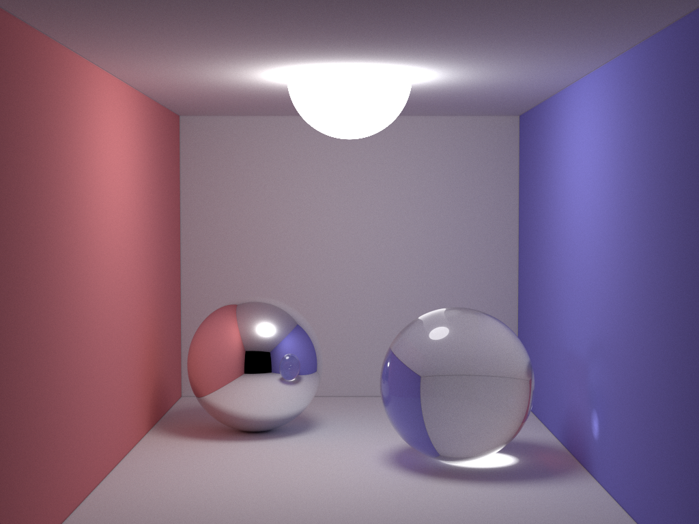

# smallpt-ispc

smallpt-ispc is a port of [smallpt](http://www.kevinbeason.com/smallpt/) to the C-like programming language of [ispc](https://ispc.github.io/), the Intel SPMD program compiler.



There are some changes compared to the original smallpt implementation:

* Uses single-precision floating point numbers. To avoid light leaking artifacts, the light source has a much smaller radius.
* No recursion.
* No ray splitting in first bounce for glass BRDF.
* Outputs HDR image in pfm format.

## Prerequisites

* CMake
* ispc

## Building

### Visual Studio 2017

```
mkdir build
cd build
cmake -DISPC=/path/to/ispc.exe -G"Visual Studio 15 2017 Win64" ..
```

Load the solution in Visual Studio and press the Build button.

### Others

Use the appropriate CMake generator for your system. It may be necessary to change the [task system](https://ispc.github.io/ispc.html#task-parallelism-runtime-requirements) used by ispc in the CMakeLists.txt file. By default it is set to Microsoft's Concurrency Runtime (`-DISPC_USE_CONCRT`).

## Usage

```
smallpt.exe [width] [height] [numSamples] [mode] [multithreading] [bounces] [russianRoulette]
```

`width`, `height`: Size of image in pixels.

`numSamples`: Number of samples per pixel, divided by 4 (i.e., 8 gives 32 samples).

`mode`: `0` for ispc, `1` for regular C compiler.

`multithreading`: `0` for single-threading, `1` for multi-threading (ispc only).

`bounces`: Number of bounces before paths are terminated with russian roulette.

`russianRoulette`: `0` disables russian roulette, `1` enables it.
